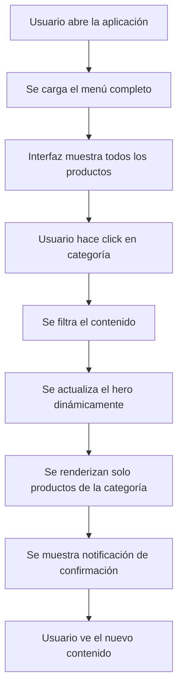

# 🍽️ Tini Restaurant - Sistema de Pedidos

Un sistema moderno de gestión de pedidos para pequeños restaurantes, diseñado con una interfaz digital intuitiva para facilitar la consulta del menú y la gestión de comandas.

[](https://developer.mozilla.org/es/docs/Web/HTML)
[](https://developer.mozilla.org/es/docs/Web/CSS)
[](https://www.python.org/)
[](https://www.sqlite.org/)

---

## 📌 Descripción del Proyecto

**Tini Restaurant** es un sistema integral de gestión de pedidos desarrollado para pequeños restaurantes. La aplicación combina una interfaz frontend moderna con HTML/CSS/JavaScript y un backend robusto en Python con base de datos SQLite.

El sistema permite:
- ✅ Visualización de menú digital organizado por categorías
- ✅ Gestión de productos disponibles
- ✅ Registro de pedidos y detalles de línea
- ✅ Interfaz responsiva para múltiples dispositivos
- ✅ Almacenamiento persistente de datos

---

## 🏗️ Arquitectura del Sistema

### Vista General

```
TiniPixelLab/
├── Front/                          # Frontend - Interfaz de usuario
│   ├── TiniRestaurant.html        # Página principal del menú
│   ├── prueba.js                  # Scripts adicionales
│   └── files/
│       └── logo_empresa.png       # Branding del restaurante
├── Back/                          # Backend - Lógica y datos
│   ├── create_db.py              # Script de inicialización de BD
│   └── tini.db                   # Base de datos SQLite
├── CSS/
│   └── style.css                 # Estilos globales
└── README.md                     # Este archivo
```

### Componentes Principales

#### 1️⃣ **Frontend (HTML/CSS/JavaScript)**
- **Archivo Principal**: `Front/TiniRestaurant.html`
- **Estilos**: `CSS/style.css`
- Interfaz responsiva con navegación lateral (sidebar)
- Filtrado dinámico de productos por categorías
- Renderizado en tiempo real del menú

#### 2️⃣ **Backend (Python/SQLite)**
- **Script de Inicialización**: `Back/create_db.py`
- **Base de Datos**: `Back/tini.db`
- Gestión de tablas: `productos`, `pedidos`, `pedido_items`
- Precarga de datos de ejemplo

#### 3️⃣ **Base de Datos**

**Tabla: `productos`**
```sql
CREATE TABLE productos (
    id INTEGER PRIMARY KEY,
    nombre TEXT NOT NULL,
    precio REAL NOT NULL,
    descripcion TEXT,
    disponible BOOLEAN DEFAULT 1,
    categoria TEXT,
    imagen TEXT
);
```

**Tabla: `pedidos`**
```sql
CREATE TABLE pedidos (
    id INTEGER PRIMARY KEY,
    cliente TEXT NOT NULL,
    mesa INTEGER,
    total REAL,
    estado TEXT DEFAULT 'pendiente',
    fecha_creacion TIMESTAMP
);
```

**Tabla: `pedido_items`**
```sql
CREATE TABLE pedido_items (
    id INTEGER PRIMARY KEY,
    pedido_id INTEGER NOT NULL,
    producto_id INTEGER NOT NULL,
    cantidad INTEGER,
    precio_unitario REAL,
    FOREIGN KEY(pedido_id) REFERENCES pedidos(id),
    FOREIGN KEY(producto_id) REFERENCES productos(id)
);
```

---

## ✨ Funcionalidades Principales

### 📋 Menú Digital Interactivo

El sistema presenta un menú digital completo con:

- **Visualización por Categorías:**
  - 🥗 Entradas (Bruschetta, Nachos, Alitas BBQ)
  - 🍖 Platos Fuertes (Lomo, Hamburguesas, Pasta, Pescado)
  - 🍰 Postres (Cheesecake, Brownies, Helado, Tartas)
  - 🥤 Bebidas (Limonadas, Milkshakes, Café, Jugos)

- **Información de Productos:**
  - Nombre del producto
  - Precio formateado
  - Descripción detallada
  - Imagen de presentación
  - Indicador de disponibilidad

### 🎨 Interfaz de Usuario

**Elementos Principales:**

1. **Sidebar Navegable**
   - Branding con logo de la empresa
   - Navegación por categorías
   - Información del horario de atención
   - Gradiente visual atractivo (púrpura/magenta)

2. **Sección Hero**
   - Titular dinámico según la categoría
   - Descripción contextual
   - Imagen destacada
   - Botones de acción (Ver menú, Promociones)

3. **Grilla de Productos**
   - Layout responsive (2 columnas en desktop, 1 en móvil)
   - Tarjetas con información y medios
   - Badges de disponibilidad
   - Efectos hover animados

4. **Notificaciones Toast**
   - Feedback visual al cambiar categorías
   - Mensajes contextuales
   - Animación de entrada suave

### 🔄 Flujo de Funcionamiento



---

## 🚀 Cómo Usar

### Requisitos Previos

- Python 3.6 o superior
- Navegador web moderno (Chrome, Firefox, Safari, Edge)
- Git (opcional, para clonar el repositorio)

### Instalación y Configuración

#### 1. **Clonar o descargar el repositorio**
```bash
git clone https://github.com/BrandonFreire/TiniPixelLab.git
cd TiniPixelLab
```

#### 2. **Inicializar la Base de Datos**
```bash
cd Back
python create_db.py
cd ..
```

Este comando:
- Crea automáticamente `tini.db` si no existe
- Crea las tablas necesarias (`productos`, `pedidos`, `pedido_items`)
- Inserta 15 productos de ejemplo precargados

#### 3. **Abrir en el navegador**

Opción A - Apertura directa:
```bash
# Linux/Mac
open Front/TiniRestaurant.html

# Windows
start Front\TiniRestaurant.html
```

Opción B - Usar un servidor local (recomendado):
```bash
# Python 3
python -m http.server 8000

# Luego abre: http://localhost:8000/Front/TiniRestaurant.html
```

### 📖 Guía de Usuario

1. **Explorar el Menú Completo**
   - Al cargar, se muestra el menú completo con todos los productos disponibles
   - Cada producto muestra nombre, precio, descripción e imagen

2. **Filtrar por Categoría**
   - Haz click en los botones del sidebar:
     - 🥗 Entradas
     - 🍖 Platos fuertes
     - 🍰 Postres
     - 🥤 Bebidas
   - El contenido se actualiza automáticamente
   - Se muestra la cantidad de productos disponibles

3. **Ver Detalles del Producto**
   - Cada tarjeta muestra información completa
   - La imagen se carga desde URLs externas de Unsplash
   - El indicador "✓ Disponible" confirma la disponibilidad

---

## 💻 Tecnologías Utilizadas

### Frontend
| Tecnología | Descripción | Versión |
|-----------|-------------|---------|
| **HTML5** | Estructura y semántica | - |
| **CSS3** | Estilos, layout grid y animaciones | - |
| **JavaScript (Vanilla)** | Interactividad y lógica | ES6+ |

### Backend
| Tecnología | Descripción | Versión |
|-----------|-------------|---------|
| **Python** | Lenguaje de programación | 3.6+ |
| **SQLite3** | Base de datos relacional | 3 |
| **Pathlib** | Manejo de rutas | Python stdlib |

### Características CSS Implementadas
- ✅ CSS Grid para layouts
- ✅ Gradientes lineales
- ✅ Flexbox para alineación
- ✅ Media queries responsivas
- ✅ Animaciones (slideIn, hover effects)
- ✅ Variables CSS personalizadas
- ✅ Sombras y bordes redondeados

### Características JavaScript
- ✅ Manipulación del DOM
- ✅ Event listeners
- ✅ Filtrado de arrays
- ✅ Template literals
- ✅ Objetos de datos complejos
- ✅ Notificaciones personalizadas

---

## 🎨 Diseño y Estética

### Paleta de Colores

```
Primario:     #874AD9 (Púrpura)
Secundario:   #B64AD9 (Magenta)
Deep:         #584AD9 (Púrpura Profundo)
Soft:         #DBB4D5 (Púrpura Suave)
Accent:       #D94A6D (Rosa/Rojo)
Fondo:        #f7f5fb (Gris muy claro)
Texto:        #1f1b2d (Casi negro)
```

### Características de Diseño
- 📐 Border radius de 22px para elementos principales
- 🎭 Gradientes atractivos en navbar y hero
- ✨ Sombras suaves y profundas
- 🔄 Transiciones suaves en interacciones
- 📱 Diseño completamente responsivo

### Responsividad

**Breakpoints:**
- Desktop: Ancho > 1050px (2 columnas de productos)
- Tablet: 820px - 1050px (1 columna, sidebar visible)
- Mobile: < 820px (1 columna, sidebar colapsado)

---

## 📊 Datos Precargados

El sistema incluye **15 productos de ejemplo** distribuidos así:

| Categoría | Productos | Ejemplos |
|-----------|-----------|----------|
| 🥗 Entradas | 3 | Bruschetta, Nachos, Alitas |
| 🍖 Platos Fuertes | 4 | Lomo, Hamburguesa, Pasta, Pescado |
| 🍰 Postres | 4 | Cheesecake, Brownie, Helado, Tarta |
| 🥤 Bebidas | 4 | Limonada, Milkshake, Café, Jugo |

**Total: 15 productos disponibles**

---

## 🔧 Estructura del Código

### Script Principal: `create_db.py`

```python
# Importa sqlite3 y pathlib para manejo de base de datos
import sqlite3
from pathlib import Path

# Define ruta de la base de datos
db_path = Path(__file__).parent / "tini.db"

# Función para crear tablas
def create_db():
    # Crea conexión
    # Ejecuta SQL para crear: productos, pedidos, pedido_items

# Función para semillas de datos
def seed_products():
    # Inserta 15 productos precargados
    # Organiza por categoría
    # Todos con disponible=1 (True)
```

### Lógica de Interfaz: `TiniRestaurant.html`

**Componentes JavaScript:**

1. **Dataset en Memoria**
   ```javascript
   const productosDisponibles = [...]  // 15 productos
   const menuData = {...}              // Filtrado por categoría
   ```

2. **Funciones Principales**
   ```javascript
   renderizarProductos(categoria)      // Dibuja las tarjetas
   cambiarCategoria(categoria)         // Coordina cambio
   actualizarHero(categoria)           // Actualiza sección destacada
   mostrarNotificacion(mensaje)        // Toast de feedback
   ```

3. **Event Listeners**
   ```javascript
   sidebar buttons → cambiarCategoria()
   hero button → cambiarCategoria('todos')
   ```

---

## 🌐 Rutas y Acceso

### Estructura de URLs

- **Página Principal**: `Front/TiniRestaurant.html`
- **Estilos**: `CSS/style.css` (importado en HTML)
- **Logo**: `Front/files/logo_empresa.png`
- **Imágenes de Productos**: URLs externas de Unsplash

### Uso con Servidor Local

```
http://localhost:8000/Front/TiniRestaurant.html
```

---

## 🔐 Estado Actual y Notas

### ✅ Implementado
- ✓ Interfaz frontend completa y funcional
- ✓ Sistema de categorización de productos
- ✓ Base de datos con esquema de pedidos
- ✓ Diseño responsive
- ✓ Data precargada de ejemplo
- ✓ Notificaciones visuales

### 🚧 En Desarrollo / Próximas Mejoras
- 🔄 Integración con backend API (Flask/FastAPI)
- 🔄 Sistema de carrito de compras
- 🔄 Procesamiento y envío de pedidos
- 🔄 Autenticación de usuarios
- 🔄 Panel de administración
- 🔄 Reportes de ventas
- 🔄 Integración de pagos

---

## 📁 Archivos Importantes

| Archivo | Descripción | Líneas |
|---------|-------------|--------|
| `Front/TiniRestaurant.html` | Página principal con lógica JS | 261 |
| `CSS/style.css` | Estilos CSS personalizados | 426 |
| `Back/create_db.py` | Script de inicialización BD | 64 |
| `Back/tini.db` | Base de datos SQLite | - |

---

## 🤝 Contribuciones

Las contribuciones son bienvenidas. Para contribuir:

1. Fork el repositorio
2. Crea una rama para tu feature (`git checkout -b feature/AmazingFeature`)
3. Commit tus cambios (`git commit -m 'Add some AmazingFeature'`)
4. Push a la rama (`git push origin feature/AmazingFeature`)
5. Abre un Pull Request

---

## 📝 Licencia

Este proyecto está bajo la Licencia MIT. Ver archivo `LICENSE` para más detalles.

---

## 👨‍💻 Autor

**Brandon Freire**

- GitHub: [@BrandonFreire](https://github.com/BrandonFreire)
- Proyecto: [TiniPixelLab](https://github.com/BrandonFreire/TiniPixelLab)

---

## 📞 Soporte y Contacto

Para reportar bugs, solicitar features o hacer preguntas:
- Abre un [Issue](https://github.com/BrandonFreire/TiniPixelLab/issues)
- Contacta directamente al autor

---

## 🎯 Hoja de Ruta (Roadmap)

### Fase 1: Mejoras de Frontend ✅ (Completada)
- Sistema de menú filtrable
- Interfaz responsiva
- Notificaciones visuales

### Fase 2: Integración Backend 🔄 (En Progreso)
- API REST con Flask/FastAPI
- Conexión con SQLite
- Endpoints de productos

### Fase 3: Funcionalidad de Pedidos ⏳ (Planeado)
- Sistema de carrito
- Cálculo de totales
- Gestión de pedidos

### Fase 4: Administración ⏳ (Planeado)
- Panel de control
- Gestión de usuarios
- Reportes

---

## 📚 Recursos Adicionales

- [Documentación SQLite](https://www.sqlite.org/docs.html)
- [MDN Web Docs - HTML/CSS/JavaScript](https://developer.mozilla.org/)
- [Python Official Docs](https://docs.python.org/3/)
- [CSS Grid Guide](https://developer.mozilla.org/en-US/docs/Web/CSS/CSS_Grid_Layout)
- [JavaScript Vanilla](https://javascript.info/)

---

**Última actualización**: Agosto 2026  
**Versión**: 1.0.0  
**Estado**: En desarrollo activo ✨

---

### ⭐ Si te gusta este proyecto, considera dejando una estrella en GitHub
